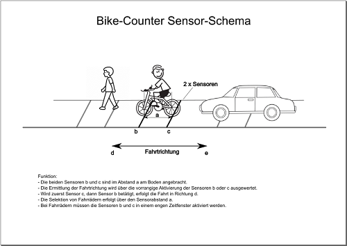
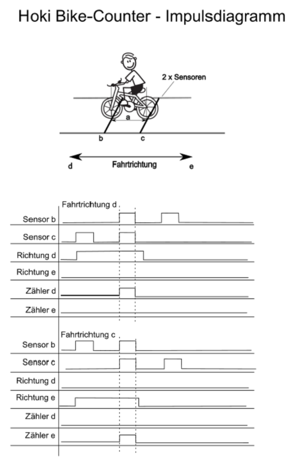
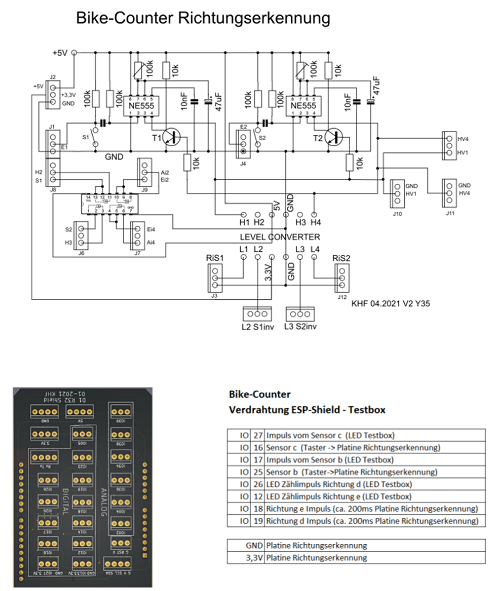
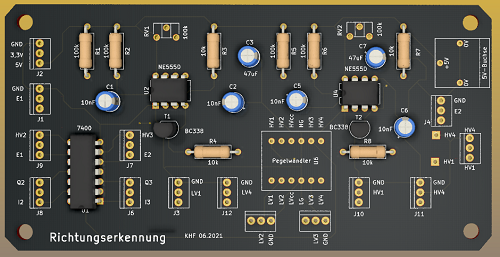
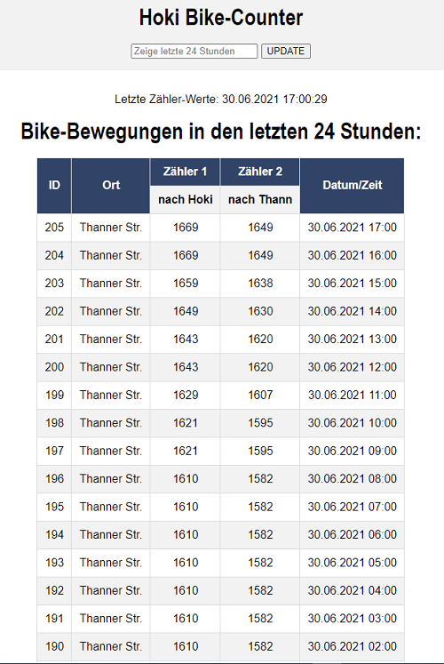
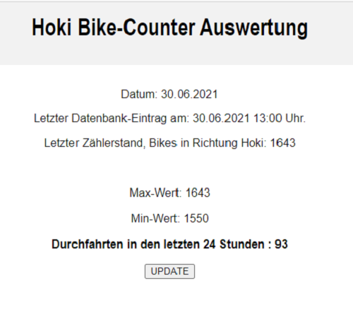

|[:skull:ISSUE](https://github.com/frankyhub/Bike-Counter/issues?q=is%3Aissue)|[:speech_balloon: Forum /Discussion](https://github.com/frankyhub/Bike-Counter/discussions)|[:grey_question:WiKi](https://github.com/frankyhub/Bike-Counter/wiki)||
|--|--|--|--|
| | | | |
||<a href="https://github.com/frankyhub/Bike-Counter/issues">|<a href="https://github.com/frankyhub/Bike-Counter/discussions">|<a href="https://github.com/frankyhub/Bike-Counter/releases">|
|| <a href="https://github.com/frankyhub/Bike-Counter/pulse" alt="Activity">| <a href="https://github.com/frankyhub/Bike-Counter/graphs/traffic">  |<a href="https://github.com/frankyhub?tab=stars"> |

# Bike-Counter

## Story
Der Bike-Counter zählt Bikes auf einer Nebenstraße in zwei unterschiedlichen Richtungen und sendet die Zählerstände an eine SQL-Datenbank. Es sollen nur Bikes gezählt werden und keine Fußgänger oder andere Fahrzeuge. Mit einem Dashboard werden die Zählerstände der Bikes angezeigt. Eine Auswertung zeigt die Durchfahrt der Bikes innerhalb der letzten 24 Stunden. Für die Erfassung der Bikes werden 2 Lichtschranken verwendet.

Vorteile des Bike-Counters: 
+ Verwendung von handelsüblichen Sensoren (Drucksensor, Lichtschranke ...)
+ Richtungserkennung der Fahrräder
+ Zählerstände auf einem Dashboard visualisiert
+ Auswertung der Bewegungen der letzten 24h
+ Nutzung der kostenlosen SQL-Datenbank des Providers (Strato)

## Hardware
+ 1 x ESP32
+ 2 x Lichtschranken PEM2D
+ 1 x Platine (Richtungserkennung)

## Software
+ Die Zählimpulse der Lichtschranken werden von der "Richtungserkennung-Platine" aufbereitet.
+ Der ESP32 übermittelt die Zählerstände an das PHP-Programm "post-data.php".
+ Die Zählerstände werden in einer SQL-Datenbank gespeichert und mit dem Dashboard "hoki-counter.php angezeigt.
+ Eine 24h-Auswertung kann mit dem Programm "auswertung.php" erfolgen.

---

   
<ol class="breadcrumb" style="border-top: 2px solid black;border-bottom:2px solid black; height: 45px; width: 900px;"> 
<a href="#oben">nach oben</a>
</ol>

  

---
